# xuanz的博客

个人技术笔记博客。从 Hexo 迁移而来的 **React SPA**，视觉语言为 **暗色杂志 · 黑金编辑风**（near-black ink + warm white + 单一 amber gold + Playfair Display / Source Serif 4 + 直角卡片）。

## 界面预览

截图目录：[`docs/screenshots/`](./docs/screenshots)（暗色）与 [`docs/screenshots/light/`](./docs/screenshots/light)（浅色），均为 1440×900。重截两种主题：`node scripts/shoot-screenshots.mjs`（需 dev server 在 `:5173`）。

### 首页

黑金 hero + 一言告示板 + 最新文章列表。

| 暗色 | 浅色 |
|---|---|
| 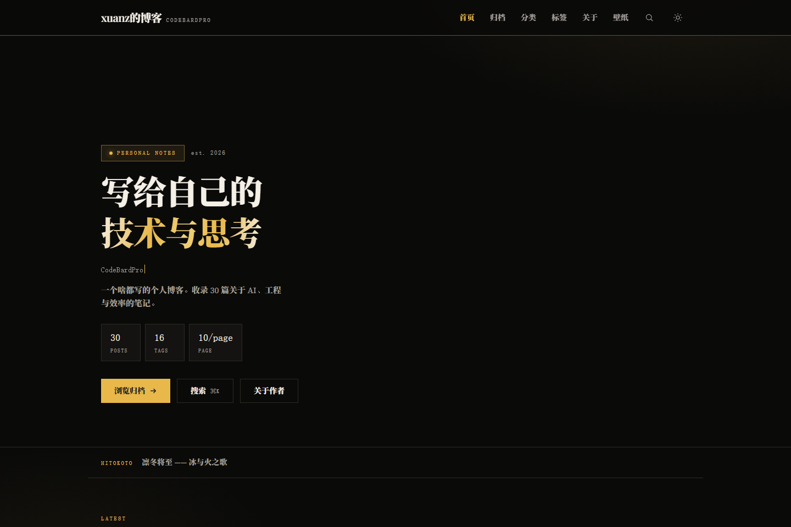 | 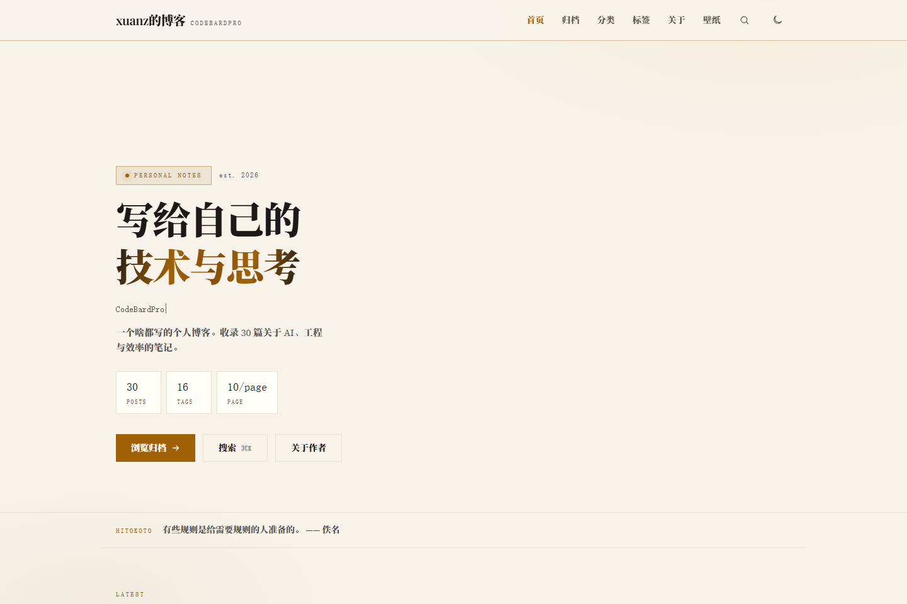 |

### 文章页

TOC、阅读进度环、字数/时长、标签、代码高亮。

| 暗色 | 浅色 |
|---|---|
| 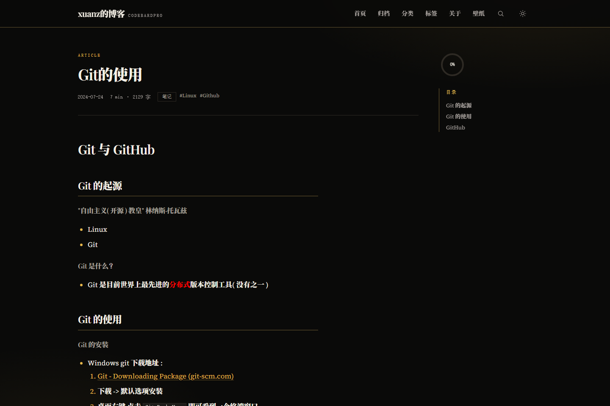 | 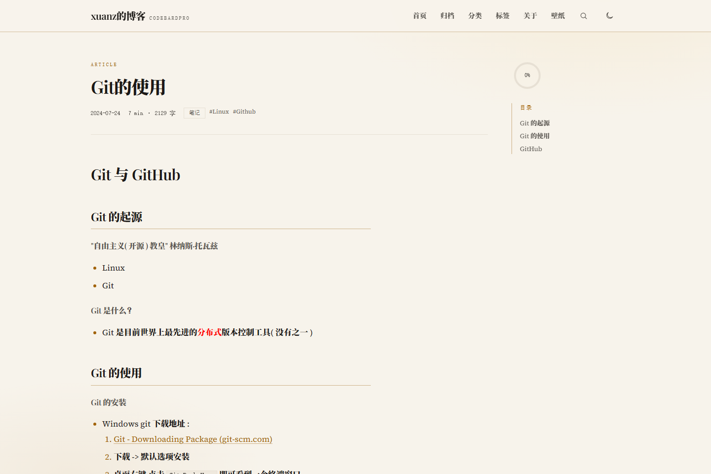 |

### 归档

按年份筛选，时间线式列表。

| 暗色 | 浅色 |
|---|---|
| 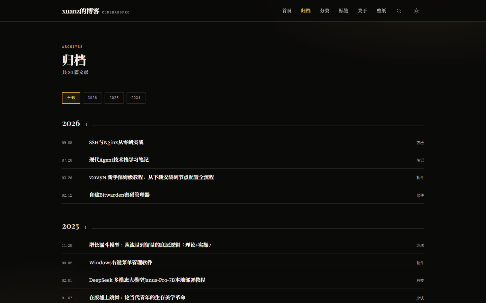 | 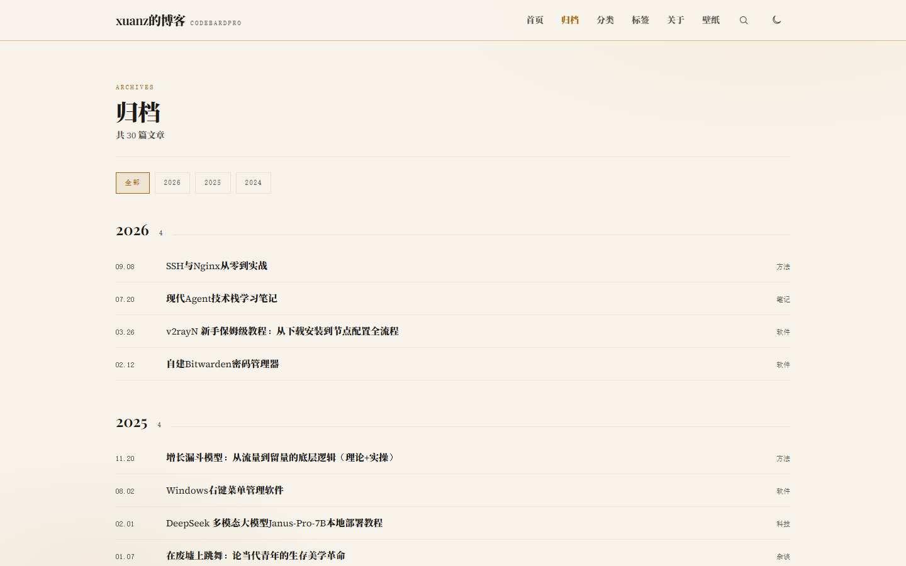 |

### 分类

分类卡片 + 占比进度条。

| 暗色 | 浅色 |
|---|---|
| 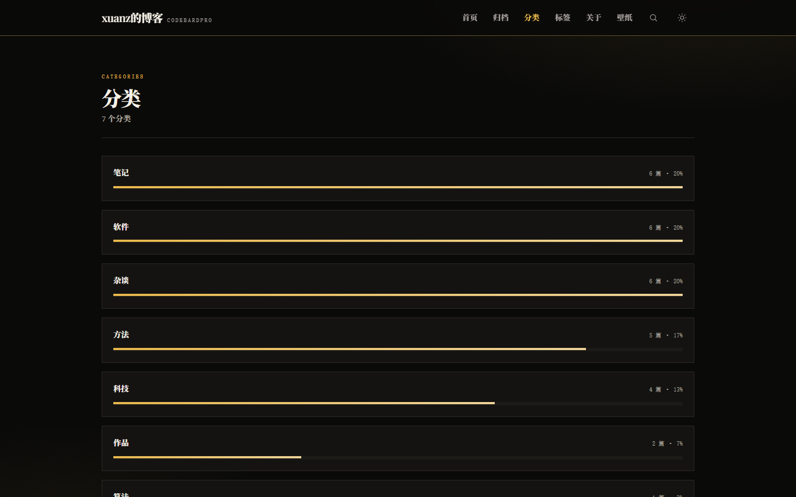 | 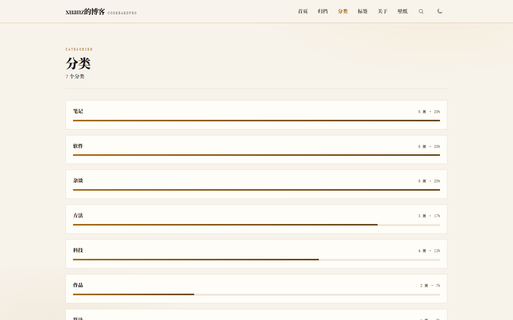 |

### 标签

标签云（可切换图谱视图）。

| 暗色 | 浅色 |
|---|---|
| 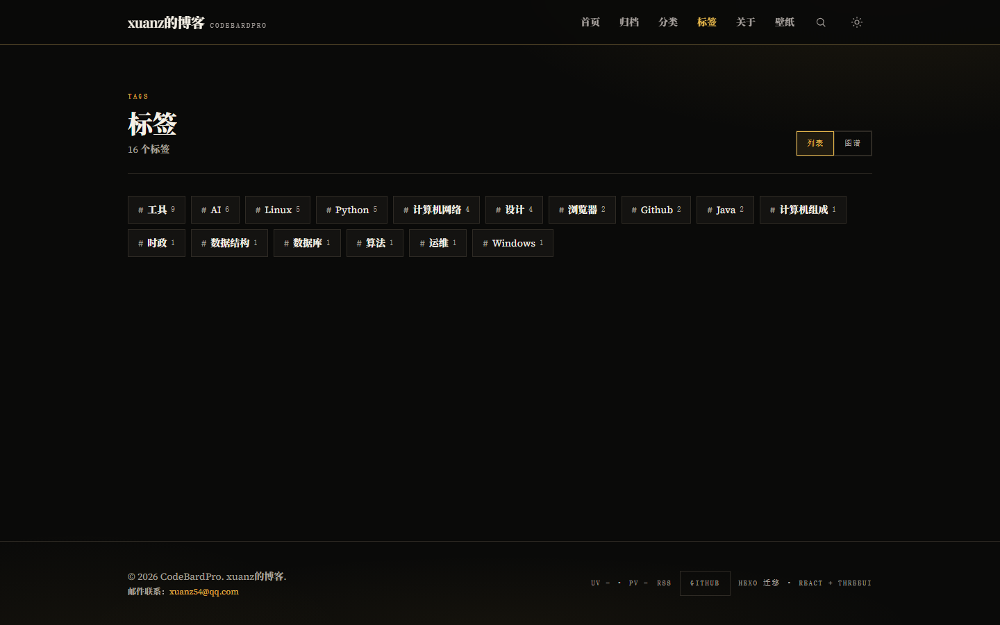 | 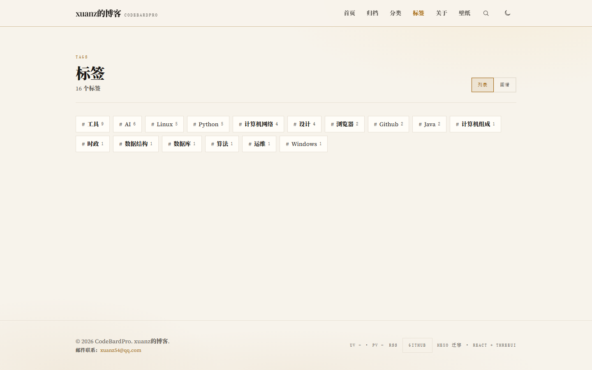 |

### 搜索

实时联想，支持 `/search/?q=` 分享 URL 与 Ctrl/⌘K 命令面板。

| 暗色 | 浅色 |
|---|---|
| 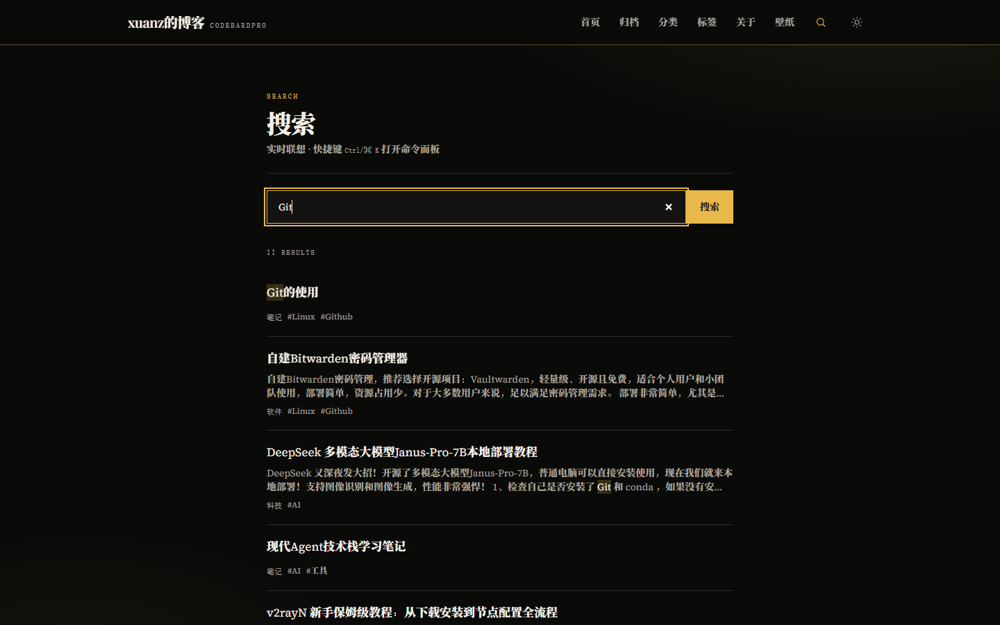 | 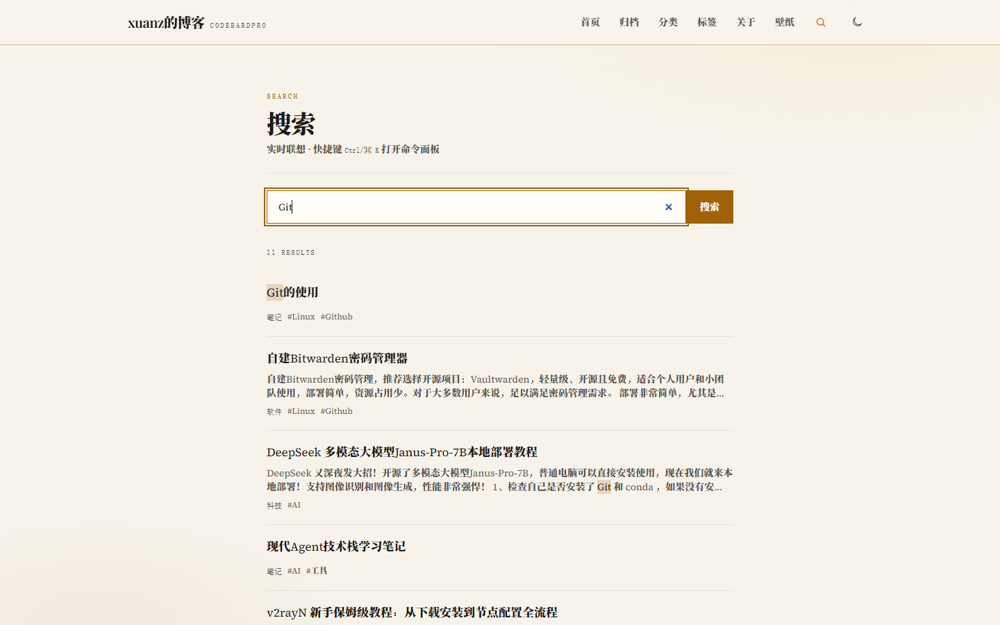 |

### 关于

Markdown 渲染 + 侧栏目录。

| 暗色 | 浅色 |
|---|---|
| 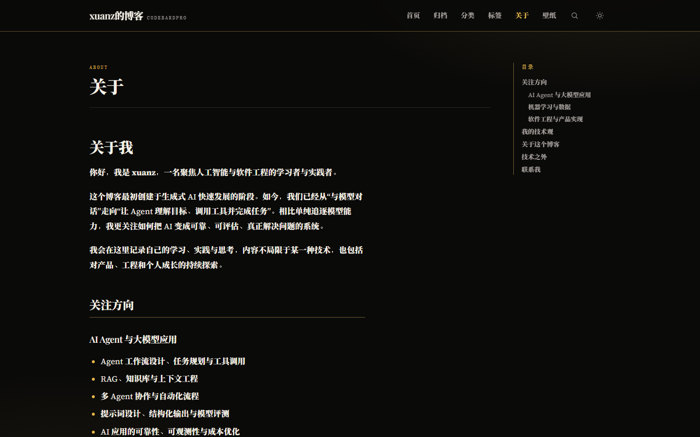 | 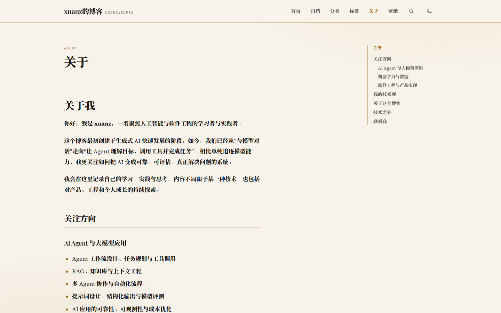 |

### 404

| 暗色 | 浅色 |
|---|---|
| 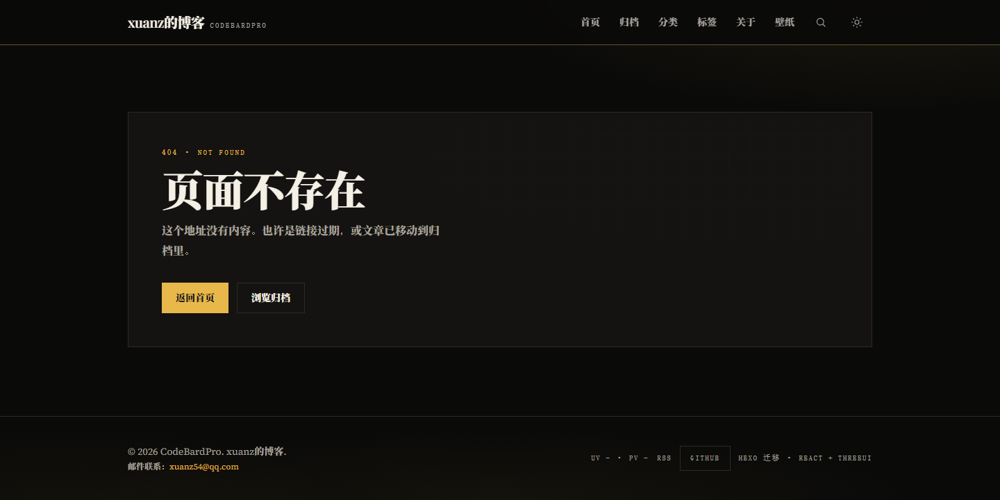 | 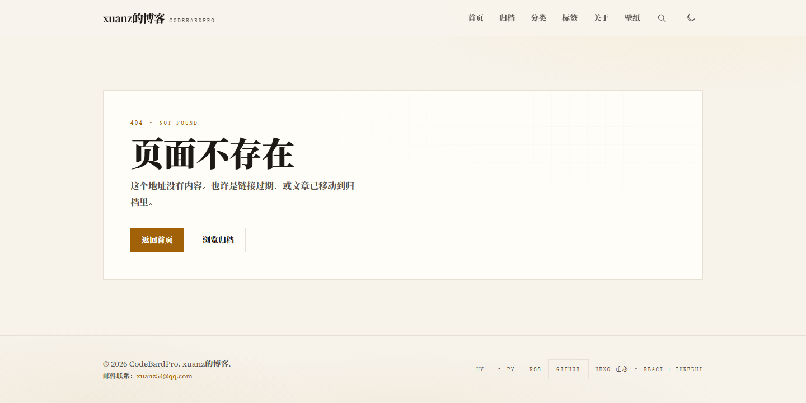 |

## 特性

- **内容管线**：`content/posts/*.md`（front-matter）→ 灰matter 解析 → marked 渲染 → Shiki 高亮
- **页面**：首页 / 文章 / 归档（年份筛选）/ 分类 / 标签（列表 + 图谱）/ 关于 / 搜索 / 分页 / 404
- **文章能力**：TOC、阅读进度条 + 进度环、代码一键复制、字数与阅读时长、上一篇/下一篇
- **互动**：打赏（支付宝/微信，含图片回退）、分享（微博 / X / QQ / 豆瓣 + 复制链接）、版权声明、Twikoo 评论占位
- **体验**：Ctrl/⌘K 命令面板、可分享搜索 URL（`/search/?q=`）、图片灯箱、Mermaid 图、点击爱心、深色模式、路由淡入
- **视觉**：ThreeUI RibbonField 单层金色 shader hero（尊重 `prefers-reduced-motion`）
- **SEO / 部署**：构建后自动生成 `sitemap.xml`、`atom.xml`、`404.html`；`robots.txt`；逐页 `title` / `description`

## 技术栈

| 层 | 选型 |
|---|---|
| 框架 | React 19 + TypeScript + Vite |
| 路由 | React Router 7 |
| 样式 | Tailwind CSS 4 + 自定义 CSS token（`src/styles/index.css`） |
| 动效 | motion（framer-motion 后继） |
| 3D / shader | Three.js + [@designcodeio/threeui](https://github.com/MengTo/threeui) RibbonField |
| Markdown | marked + gray-matter + Shiki + mermaid |
| Lint | oxlint |

设计规范见 [`DESIGN.md`](./DESIGN.md)。

## 快速开始

```bash
npm install
npm run dev        # http://127.0.0.1:5173
```

```bash
npm run lint       # oxlint
npm run build      # tsc + vite build + scripts/build-seo.mjs
npm run preview    # 预览 dist
```

## 目录结构

```
xuanz-blog/
├── content/
│   ├── posts/           # 文章 Markdown
│   ├── about/           # 关于页
│   └── posts.manifest.json
├── public/              # 静态资源（favicon、图片、打赏码、robots.txt）
├── scripts/
│   ├── build-seo.mjs        # 构建后生成 sitemap / atom / 404
│   ├── shoot-screenshots.mjs # README 截图
│   └── rename-posts.mjs     # 迁移工具
├── docs/screenshots/        # README 用页面截图（暗色 + light/ 浅色）
├── src/
│   ├── components/      # 页面与文章组件
│   ├── config/site.ts   # 站点配置（唯一入口）
│   ├── content/         # 运行时内容索引
│   ├── lib/             # markdown / frontmatter / mermaid …
│   ├── hooks/
│   └── styles/index.css # 设计 token 与全局样式
└── DESIGN.md            # 视觉规范（黑金杂志）
```

## 写一篇文章

在 `content/posts/` 新建 `.md`：

```markdown
---
title: 文章标题
slug: 可选-中文永久链接
date: 2026-09-24 12:00:00
categories:
  - 技术
tags:
  - React
description: 可选摘要，用于列表与 meta
top: true              # 可选：列表置顶
toc: true
no_reward: false
---

正文从这里开始。
```

- `slug` 缺省时用文件名；存在时用于 URL（兼容原 Hexo 中文路径）。
- 图片放 `public/images/posts/<组名>/`，正文引用 `/images/posts/...`。
- 含 mermaid 时可用 ```` ```mermaid ```` 代码块，或 HTML `<div class="mermaid">`。

## 站点配置

所有开关集中在 [`src/config/site.ts`](./src/config/site.ts)：

| 配置 | 说明 |
|---|---|
| `title` / `description` / `url` / `nav` | 站点信息与导航（支持 `external: true` 外链） |
| `postsPerPage` | 分页大小（默认 10） |
| `effects.clickHeart` / `effects.broadcast` | 点击爱心、首页一言 |
| `features.lightbox` / `mermaid` / `copyright` | 灯箱、Mermaid、版权声明 |
| `analytics.busuanzi` | 页脚 UV/PV |
| `reward.alipay` / `reward.wechat` | 打赏二维码路径 |
| `comments.twikooEnvId` | Twikoo 环境 ID；**留空则显示占位说明** |

## 部署（GitHub Pages）

1. 构建：`npm run build` → 产物在 `dist/`（已含 `404.html` / `sitemap.xml` / `atom.xml`）。
2. 将 `dist/` 发布到 `xuanz54.github.io` 仓库的默认分支根目录，或使用 Actions 部署 Pages。
3. 确认 `site.ts` 的 `url` 与线上域名一致（影响 sitemap / 版权链接）。

> 本仓库是 SPA。GitHub Pages 深链刷新依赖 `dist/404.html`（构建脚本已复制 `index.html`）。

## 相关

- 设计：[`DESIGN.md`](./DESIGN.md)（黑金杂志 token 与动效红线）
- 主题参考：[threeui](https://github.com/MengTo/threeui)
- 前身：Hexo + ayer 主题（本地迁移，未随本仓库分发）

## License

个人博客，文章版权归作者所有。代码可自由参考使用。
